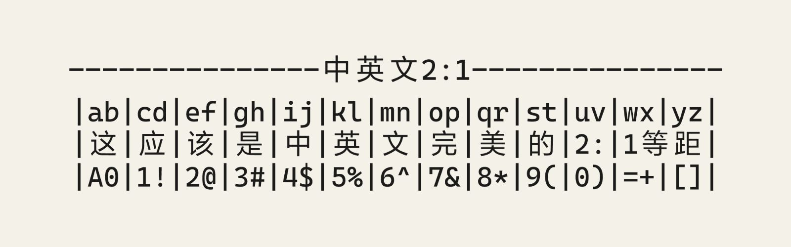

# Caya Code

<picture>
  <source media="(prefers-color-scheme: dark)" srcset="assets/caya-code-preview-dark.png">
  <source media="(prefers-color-scheme: light)" srcset="assets/caya-code-preview-light.png">
  
</picture>

Caya Code 是一款等宽字体，专注于优化中文用户的编程体验。拉丁字符、编程符号及连字来自 Cascadia Code，中文、日文假名及其他缺失字符由微软雅黑（Microsoft YaHei）补充；中文字符占两个英文字符宽度；提供 Light、SemiLight、Regular、SemiBold 和 Bold 五种字重。

## 授权说明

[Cascadia Code](https://github.com/microsoft/cascadia-code) 采用 [SIL Open Font License 1.1](https://github.com/microsoft/cascadia-code/blob/main/LICENSE)；[微软雅黑](https://learn.microsoft.com/en-us/typography/font-list/microsoft-yahei)属于专有字体。

本项目仅供拥有相应字体许可的用户学习和研究，请勿转载。

## 下载

从 [Releases](https://github.com/JackerGamer/Cascadia-YaHei/releases/latest) 下载最新的 TTF 文件。

## 构建

在已安装 Cascadia Code 和微软雅黑的 Windows 10/11 上运行：

```powershell
powershell -ExecutionPolicy Bypass -File .\build.ps1
```

字体输出到 `build/fonts/`。首次构建会在 `.venv` 中安装 FontTools。

自定义字体名称：

```powershell
powershell -ExecutionPolicy Bypass -File .\build.ps1 --family "My Code Font"
```

## 安装与编辑器设置

关闭正在使用字体的编辑器，安装下载或生成的 TTF 文件。VS Code 示例：

```json
{
  "editor.fontFamily": "'Caya Code'",
  "editor.fontLigatures": true
}
```

若仍显示旧版本，请先卸载旧版，再重新安装并重启编辑器。
